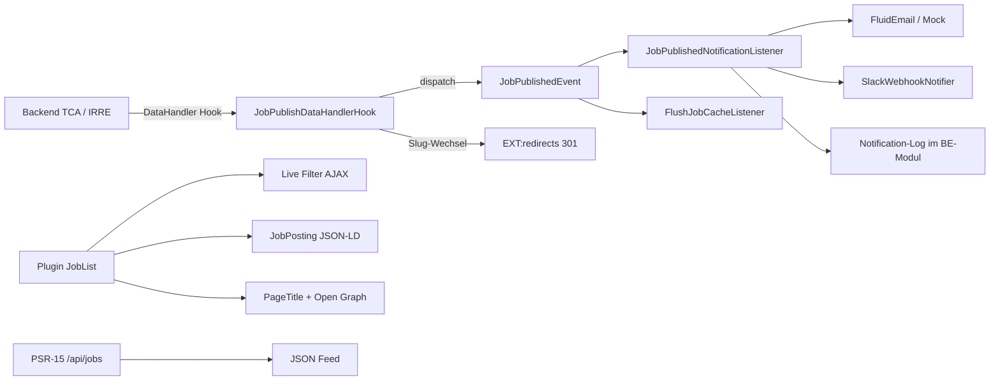

# Smart Job Finder

TYPO3-Extension für Stellenanzeigen. Backend mit TCA, IRRE, Slug und Kategorien. Frontend mit Live-Filter und schema.org-JobPosting. Beim Veröffentlichen feuert ein PSR-14-Event Mock-Mail und optional einen Slack-Webhook.

Kompatibel mit **TYPO3 12.4, 13.4 und 14**.

## Architektur



Der DataHandler hat in TYPO3 12–14 kein generisches „Record published“-PSR-14-Event. Der Hook ist deshalb nur die Brücke: sobald eine Stelle sichtbar wird, wird `JobPublishedEvent` dispatched. Mail, Slack, Cache-Flush und Log hängen am Event — nicht am Hook.

## Installation

Composer-Projekt:

```bash
composer require agentur/smart-job-finder
```

Pfad-Repository (dieses Portfolio):

```json
{
  "repositories": [
    { "type": "path", "url": "smart-job-finder" }
  ]
}
```

Danach:

1. Extension im Extension Manager / `typo3 extension:setup` aktivieren
2. Datenbank-Analyse ausführen (Tabellen `tx_smartjobfinder_*`)
3. TypoScript einbinden:
   - **TYPO3 12:** Static Include „Smart Job Finder“
   - **TYPO3 13/14:** Site Set `agentur/smart-job-finder` **oder** dasselbe Static Include
4. Sysordner anlegen, Firmen und Stellen erfassen, Kategorien zuordnen
5. Inhaltselement **Smart Job Finder** auf der Listenseite platzieren, Storage-PID im FlexForm setzen

## Backend

| Thema | Umsetzung |
| --- | --- |
| TCA | Moderne Feldtypen (`slug`, `category`, `datetime`, `link`, `email`, `file`, `inline`) |
| IRRE | Anforderungen und Benefits als sortierbare Inline-Kinder der Stelle |
| Slug | Automatisch aus dem Titel, `uniqueInSite` |
| Kategorien | `sys_category` über TCA `type: category` |
| Firma | Wiederverwendbarer Select (kein IRRE), Logo als FAL |
| Modul | Web → Job Finder: Kennzahlen, Google-Jobs-Score, Notification-Log |
| Preview | Page-Modul zeigt Stellenzahl und Live-Filter-Status |

Eine Stelle gilt als **veröffentlicht**, wenn sie neu und nicht versteckt angelegt wird oder `hidden` von 1 auf 0 wechselt (Glühbirne). Workspace-Entwürfe werden ignoriert.

## Frontend

- Plugin als eigener **CType** `smartjobfinder_joblist` (kein deprecated `list_type`, damit TYPO3 14 läuft)
- Live-Filter (Suche, Ort, Anstellungsart, Arbeitsmodell) per `fetch`, ohne JavaScript als GET-Formular
- Detailseite mit schema.org **JobPosting** JSON-LD, **PageTitleProvider** und Open-Graph-Meta
- Listenansicht zusätzlich mit **ItemList** JSON-LD
- Cache-Tags `tx_smartjobfinder` / `tx_smartjobfinder_job_{uid}` — Flush bei Veröffentlichung
- Featured-Stellen stehen oben

Route Enhancer (in die Site-Config übernehmen): siehe [`Documentation/route-enhancer.yaml`](Documentation/route-enhancer.yaml). Danach z. B. `/jobs/typo3-integrator`.

Slug-Wechsel schreibt bei geladenem `EXT:redirects` einen 301 von `/jobs/alter-slug` → `/jobs/neuer-slug` (Prefix über Extension Configuration).

## JSON-API

`GET /api/jobs` (auch unter `/de/api/jobs`) liefert einen JSON-Feed, **bevor** TYPO3 die Seite auflöst (PSR-15 Middleware).

Ohne gesetztes `apiStoragePid` antwortet die API mit **403** — sie listet nicht alle Jobs der Instanz. Abgelaufene `valid_through`-Stellen erscheinen weder in Liste, Detail (404) noch API, auch wenn der Scheduler noch nicht gelaufen ist.

Slug-Wechsel schreibt den Redirect **und** baut den Redirect-Cache von `EXT:redirects` neu. Ein reines `INSERT` würde sonst erst nach Cache-Flush greifen.

## PSR-14 Notifications

Einstellungen unter **Admin Tools → Settings → Extension Configuration → smart_job_finder**:

| Option | Default | Bedeutung |
| --- | --- | --- |
| `notificationsEnabled` | an | Listener aktiv |
| `mockMode` | an | Kein echter Versand: Payload im Log + BE-Modul |
| `mailTo` / `mailFrom` | Beispieladressen | Wird nur ohne Mock-Modus genutzt (FluidEmail) |
| `slackWebhookUrl` | leer | Incoming Webhook; nur ohne Mock-Modus |
| `jobPathPrefix` | `/jobs` | Prefix für Slug-Redirects |
| `apiStoragePid` | `0` | Pflicht für `/api/jobs` (sonst 403, kein Instanz-Leak) |

Demo ohne Backend-Klick:

```bash
vendor/bin/typo3 smart-job-finder:notify-test
vendor/bin/typo3 smart-job-finder:expire
```

`expire` ist schedulable (Scheduler-Task) und setzt `hidden=1` bei abgelaufenem `valid_through`.

Eigene Reaktion auf Veröffentlichung:

```php
use Agentur\SmartJobFinder\Event\JobPublishedEvent;

public function __invoke(JobPublishedEvent $event): void
{
    // $event->getUid(), getTitle(), getRecord() …
}
```

## TYPO3 12 / 13 / 14

- Plugin-Registrierung als CType; fünfter `configurePlugin`-Parameter nur, wenn die Core-API ihn noch kennt
- Event-Listener per Services.yaml-Tag (nicht nur `#[AsEventListener]`, das reicht erst ab v13)
- Cache-Tags: `AddCacheTagEvent` ab v13, sonst `TSFE->addCacheTags()`
- `ext_tables.sql` bleibt für v12 die Schema-Quelle; v13/14 generieren ergänzend aus TCA
- Site Set für v13/14, Static TypoScript für v12
- PHP 8.1+, keine v14-only-APIs

## Performance

Die Standard-Liste (`list`) ist **page-cacheable**. Live-Filter trifft die uncached `filter`-Action. Beim Publish werden Cache-Tags und der eigene `smart_job_finder`-Cache geleert.

Weitere Entscheidungen:

| Thema | Umsetzung |
| --- | --- |
| Pagination | `itemsPerPage` (Default 12), kein unbegrenztes `findAll` |
| N+1 | Firmennamen per einem JOIN, Kategorien nicht in der Liste |
| Dropdown-Orte | `SELECT DISTINCT`, keine hydrierten Models |
| Suche | MySQL `FULLTEXT` / `MATCH AGAINST`, sonst `LIKE` |
| `/api/jobs` | getaggter Cache 60s, Limit 100, Language + Enable Fields |
| Notification-Log | `expire` löscht Einträge älter als 90 Tage |

`FULLTEXT` in `ext_tables.sql` ist MySQL/MariaDB. PostgreSQL: Index weglassen, der Code fällt auf LIKE zurück.

## Tests

```bash
vendor/bin/phpunit -c phpunit.xml.dist
```

Die Unit-Tests für Event, JSON-LD-Encoding und Google-Jobs-Score brauchen kein vollständiges TYPO3. Der Slack-Payload-Test wird übersprungen, wenn Core-Klassen fehlen.
